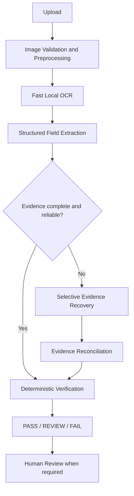

# LabelVerify

AI-assisted alcohol label verification for federal regulatory workflow support.

**Version:** v0.8.0

LabelVerify is a standalone **decision-support prototype** designed to help compliance agents review alcohol beverage labels quickly, consistently, and transparently.

It combines:

- local OCR
- structured field extraction
- deterministic verification rules
- selective evidence recovery
- optional, configurable AI-assisted visual analysis

**LabelVerify does not make final regulatory determinations.** When evidence cannot be established with sufficient confidence, the system returns **REVIEW** for human judgment rather than silently guessing.

### Scope and independence

- Current prototype scope focuses on **selected distilled-spirits checks**
- **Single Label** and **Batch Review** workflows are supported
- LabelVerify is an **independent prototype**
- It is **not** an official U.S. Department of the Treasury or TTB application
- It does **not** use official agency seals or insignia

---

## The problem

Federal alcohol labeling review involves large volumes of applications and limited compliance-agent capacity. Stakeholder context for this prototype includes on the order of **~150,000 label applications annually**, with routine work that compares label evidence to application data (brand, class/type, alcohol content, net contents, and related checks). Peak-volume submissions can contain **hundreds** of applications in a batch.

Adoption depends on **speed**, **simplicity**, and **trust**. Opaque AI-only verification is intentionally avoided: agents need explainable outcomes, clear uncertainty, and a system that still functions when external AI or network access is unavailable.

---

## Design principles

1. **Fast local processing first.** Routine labels should complete on a local OCR and rules path without requiring generative AI.
2. **Escalate only when evidence is uncertain.** Additional OCR or AI visual recovery is selective, not unconditional.
3. **AI recovers evidence; it does not make regulatory decisions.** Recovered text is validated and re-evaluated by deterministic rules.
4. **Deterministic rules decide deterministic questions.** Normalization and comparisons remain transparent and testable.
5. **Uncertainty is surfaced to a human rather than hidden.** Incomplete or conflicting evidence becomes REVIEW, not false confidence.
6. **Core verification remains functional without external AI.** OpenAI is optional, off by default, and backend-only.

---

## How it works



**Selective evidence recovery** (only when needed) may include:

- targeted Tesseract retry / brand-region OCR
- optional secondary OCR (when configured and available)
- optional OpenAI visual evidence recovery (when configured and eligible)

Not every request invokes every stage. AI is never required for core operation.

Pipeline concerns stay separated: API routing, OCR, preprocessing, extraction, normalization, rules, confidence, AI provider, and batch orchestration. See [docs/ARCHITECTURE.md](docs/ARCHITECTURE.md) and [docs/AI_FALLBACK.md](docs/AI_FALLBACK.md).

---

## Why this architecture

Most routine verification checks do not require generative AI. Local OCR and deterministic rules provide:

- **speed** for the stakeholder usability target
- **explainability** (reason codes, per-check outcomes)
- **predictable behavior** under test
- **resilience** when external AI or network access is unavailable

When initial evidence is incomplete or uncertain, LabelVerify can selectively apply additional OCR and, if configured, AI-assisted visual analysis. Recovered evidence is reconciled and sent back through deterministic verification. AI therefore serves primarily as an **evidence-recovery** mechanism rather than the compliance decision engine.

---

## Supported verification scope

**Regulatory prototype class:** distilled spirits.

**Selected automated checks:**

| Check | Role in the prototype |
|-------|------------------------|
| Brand Name | Recover and evaluate brand evidence (fuzzy matching where appropriate) |
| Class / Type | Recover class/type designation; partial or conflicting evidence → REVIEW |
| Alcohol Content / ABV | Prefer percentage alcohol-by-volume statements; proof alone may require REVIEW |
| Net Contents | Recover quantity and unit with normalization |
| Government Health Warning | Evaluate machine-readable warning text where sufficient evidence is available |

Machine-readable warning text can be evaluated when OCR/AI recovery provides enough evidence. **Formatting or physical requirements** that cannot be reliably established from an uploaded image (for example bold type or type size) remain subject to **human review**.

This is **not** full TTB compliance coverage. Rule notes and sources: [docs/RULES.md](docs/RULES.md).

---

## PASS / REVIEW / FAIL

| Status | Meaning |
|--------|---------|
| **PASS** | The selected automated check is supported by sufficiently reliable evidence. |
| **REVIEW** | Evidence is incomplete, ambiguous, conflicting, or requires human judgment. |
| **FAIL** | A sufficiently reliable material mismatch was detected for an automated check. |

These are **prototype decision-support statuses**, not final TTB regulatory determinations.

---

## Designed to surface uncertainty

LabelVerify distinguishes between:

- a **confirmed mismatch** (FAIL), and
- evidence that **cannot be read or established reliably** (REVIEW)

Situations that often produce REVIEW rather than automatic failure include poor image quality, decorative typography, glare, small or low-contrast warning text, and conflicting extraction evidence.

This is intentional: uncertainty should be visible to the human reviewer rather than converted into false confidence.

---

## Single Label Review

Typical flow:

1. **Review Setup** (left rail) → **Single Label**
2. Upload a label image
3. **Analyze Label**
4. Inspect **Results** (right panel)
5. Optionally **Download Excel Report**

**Analyze another label** clears the completed single-label result and opens a fresh Single Label upload workflow.

The Review Setup rail also includes a secondary **How It Works** information control. It opens in-product documentation in a modal without clearing the current Results state.

Demo image: `test-data/demo/old-tom-demo.jpg`

---

## Batch Review

Batch Review processes multiple labels from a CSV manifest plus matching images:

1. **Batch Review** → validate manifest and images
2. Process the batch under bounded concurrency
3. Inspect aggregate results (PASS / REVIEW / FAIL counts)
4. Filter by status and open item detail as needed
5. Optionally download an Excel report

Prototype batch size is bounded (`BATCH_MAX_ITEMS=300` by default) to reflect stakeholder peak order of magnitude. Details: [docs/BATCH_REVIEW.md](docs/BATCH_REVIEW.md).

---

## Performance

Approximately **five seconds** is the **usability target** for routine single-label verification—not a guarantee for every image.

- Clean / routine labels prioritize fast local processing
- Difficult labels may invoke additional evidence-recovery stages and take longer
- Measured results are documented in [docs/PERFORMANCE.md](docs/PERFORMANCE.md) and [docs/RELEASE_QA.md](docs/RELEASE_QA.md)

Prototype measurements are **not** Treasury production capacity claims.

---

## Security, privacy, and operational logging

- Secrets remain **backend-only** (never in `VITE_*` frontend env)
- Upload size limits, magic-byte validation, and safe client errors
- Path-traversal and CSV / spreadsheet formula-injection defenses where applicable
- Bounded batch concurrency and AI call budgets
- An access gate (for example Cloudflare Access) is recommended before any public HTTPS exposure — see [docs/DEPLOYMENT.md](docs/DEPLOYMENT.md)

### Operational audit logging

Structured **JSON** operational events are written to backend stdout for Docker log inspection. No analytics database was introduced for this prototype.

| Event | Purpose |
|-------|---------|
| `site_access` | SPA load telemetry (`POST /api/v1/telemetry/access`, once per load) |
| `single_review_started` / `single_review_completed` | Single Label lifecycle (status, duration, AI/OCR flags, quality) |
| `batch_review_started` / `batch_review_completed` | Batch aggregates (counts, AI calls, duration) |
| `application_error` | Safe operational errors (stage, exception type, short message) |

Logs intentionally **exclude**: uploaded image contents, potentially sensitive filenames, extracted label text, application values, AI prompts/responses, API keys, authorization credentials, cookies, fingerprints, and location.

Inspect logs:

```bash
docker compose logs -f backend
docker compose logs -f backend | grep single_review_completed
```

More filter examples: [docs/DEPLOYMENT.md](docs/DEPLOYMENT.md).

---

## Development setup

### Backend

```bash
cd backend
python -m venv .venv
# Windows: .venv\Scripts\activate
source .venv/bin/activate
pip install -e ".[dev,ocr-tesseract]"
# Host Tesseract required for local (non-Docker) OCR
uvicorn app.main:app --reload --app-dir .
```

### Frontend

```bash
cd frontend
npm install
npm run dev
```

Open http://localhost:5173 — Vite proxies `/api` to the backend.

### Environment

```bash
cp backend/.env.example backend/.env
# Edit backend/.env — set OPENAI_ENABLED and OPENAI_API_KEY only if you want AI recovery
```

Optional Compose interpolation file: copy [`.env.example`](.env.example) to `.env`.

Never commit secrets. OpenAI remains optional, configurable, and backend-only.

---

## Docker deployment

Docker Compose provides a reproducible standalone deployment (usable locally without Cloudflare):

```bash
cp backend/.env.example backend/.env
# optional: cp .env.example .env
docker compose up --build -d
# UI: http://localhost:8080  (loopback-bound by default)
```

- Backend container includes **Tesseract** (no host OCR dependency)
- Frontend nginx serves the SPA and proxies same-origin `/api`
- Health / readiness: `/health/live`, `/ready` (do not require OpenAI or Cloudflare)
- Restart policy: `unless-stopped` on both services
- Evaluation deploy is intended at **https://labelverify.framesfirstsystems.com**, protected by Cloudflare Access and reached through Cloudflare Tunnel (`cloudflared` on the Mac host — not in Compose)

Full guide (including Cloudflare Access + Tunnel): [docs/DEPLOYMENT.md](docs/DEPLOYMENT.md).

---

## Testing

```bash
cd backend && pytest && ruff check app tests
cd frontend && npm test && npm run build
# Optional Playwright smoke (requires browsers installed):
cd frontend && npm run test:e2e
```

QA matrix and measured results: [docs/RELEASE_QA.md](docs/RELEASE_QA.md).

---

## Limitations

- Prototype only — not official Treasury / TTB software; no official seals
- Selected distilled-spirits checks only — not full regulatory coverage
- Fuzzy thresholds and image-quality heuristics are engineering aids, not legal certainty
- Difficult imagery may require human review
- Some physical / formatting requirements cannot be reliably established from uploaded images
- In-memory batch jobs are lost on restart
- External AI recovery requires configured network / API access (optional)
- No direct COLA integration
- No production authorization / ATO claim

---

## Future production integration

Potential production concerns beyond this prototype include durable job storage, agency identity and access management, broader beverage classes, formal retention requirements, direct workflow-system integration, and production security / authorization controls.

Architecture changes should be recorded in [docs/DECISIONS.md](docs/DECISIONS.md). OCR selection rationale lives in [docs/OCR_EVALUATION.md](docs/OCR_EVALUATION.md).

---

## Shortest evaluation path

**Single Label:** Review Setup → Single Label → upload `test-data/demo/old-tom-demo.jpg` → Analyze Label → Results.

**Batch:** Batch Review → sample manifest + `test-data/batch-sample/*.jpg` → Process → filter / detail → Download Excel Report.

**How It Works:** Review Setup → How It Works (information control) → read in-product overview → Close (Results preserved).

---

## Documentation index

| Doc | Contents |
|-----|----------|
| [docs/REQUIREMENTS.md](docs/REQUIREMENTS.md) | System requirements |
| [docs/ARCHITECTURE.md](docs/ARCHITECTURE.md) | Pipeline design |
| [docs/RULES.md](docs/RULES.md) | Regulatory rule notes |
| [docs/FIELD_EXTRACTION.md](docs/FIELD_EXTRACTION.md) | Field extraction |
| [docs/AI_FALLBACK.md](docs/AI_FALLBACK.md) | Optional AI evidence recovery |
| [docs/BATCH_REVIEW.md](docs/BATCH_REVIEW.md) | Batch orchestration |
| [docs/UI_DESIGN.md](docs/UI_DESIGN.md) | Institutional UI |
| [docs/PERFORMANCE.md](docs/PERFORMANCE.md) | Timing targets and measurements |
| [docs/OCR_EVALUATION.md](docs/OCR_EVALUATION.md) | OCR evaluation |
| [docs/DEPLOYMENT.md](docs/DEPLOYMENT.md) | Docker, logging, access gate |
| [docs/RELEASE_QA.md](docs/RELEASE_QA.md) | QA matrix and measured results |
| [docs/DECISIONS.md](docs/DECISIONS.md) | Architecture decision records |
